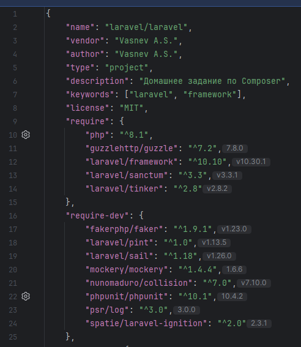

### Ответы на вопросы к Compose
1. Разница между файлами 
- composer.json содержит информацию об установленных пакетах и их вервии, также информацию о проекте
- composer.lock служит для сохранения инфорамации среды, версии пакетов и их зависимостей
2. -dev зависимости используются только для разработки и не учавствуют в продуктовой сборке 
3. composer install служит для установок из уже готового проекта, а composer update обновляет пакеты из composer.lock

### Ответы на вопросы к Laravel
1. Laravel после установки использует  
   "php": "^8.1",  
   "guzzlehttp/guzzle": "^7.2",  
   "laravel/framework": "^10.10",  
   "laravel/sanctum": "^3.3",  
   "laravel/tinker": "^2.8",  
   "fakerphp/faker": "^1.9.1",  
   "laravel/pint": "^1.0",  
   "laravel/sail": "^1.18",  
   "mockery/mockery": "^1.4.4",  
   "nunomaduro/collision": "^7.0",  
   "phpunit/phpunit": "^10.1",  
   "psr/log": "^3.0",  
   "spatie/laravel-ignition": "^2.0"  
   
2. В директории config находятся файлы, которые на основе данных из .env файла формируют настройки конфигурации приложения
3. Основные файлы (классы) с бизнес-логикой приложения хранятся в App.
